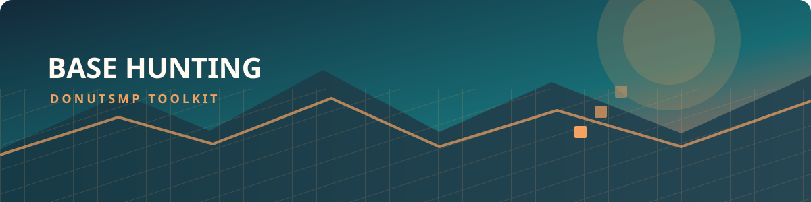

<div align="center">



# Dogs BaseHunting / QQL Tools

**Base hunting, stash discovery, and DonutSMP utilities for AUTISM Client**

[](https://www.minecraft.net/)
[](https://fabricmc.net/)
[](https://adoptium.net/)
[](LICENSE)

</div>

A client-side addon for the AUTISM Client that bundles base-finding tools for DonutSMP, including
seed cracking, coordinate finding, RTP stash hunting, an auction-house flipper, and a broader set of
utility modules. It loads as its own jar alongside the AUTISM client.

<div align="center">

[Overview](#overview) · [Features](#features) · [Quick Start](#quick-start) · [Requirements](#requirements) · [Install](#install) · [Build](#build) · [Credits](#credits) · [License](#license)

</div>

<div align="center">

| FIND | CRACK | SCAN | AUTOMATE |
| :---: | :---: | :---: | :---: |
| Base and stash discovery | Seed and terrain analysis | ESP, overlays, and radar | RTP, Baritone, and utility tools |

</div>

> [!WARNING]
> Several modules move or act automatically (RTP, Baritone, elytra, auto-eat, auto-log, etc.) and may be flagged by server anti-cheats. Use at your own risk.
>
> Please use Prism Launcher if possible; the default Minecraft launcher can cause issues.

## Overview

This addon combines a handful of different modules into one package so you can use a single jar with AUTISM Client instead of juggling multiple separate mods. The project focuses on base hunting, stash discovery, seed utility work, and general quality-of-life tools.

## Features

### Core modules

- **Seedcracker** — SeedCrackerX integration for seed cracking and chunk/structure analysis.
- **Bedrock Finder** — Finds valuable terrain features and coordinate-based points of interest.
- **Donut RTP Stash Finder** — Uses RTP + automated digging to locate stash blocks around 0,0 and log results.
- **Relog Loader** — Forces chunk reloads so ESP and region scanners can read newly generated terrain.

### Module groups

| Section | Included tools |
| --- | --- |
| **Core** | Seedcracker, Bedrock Finder, Donut RTP Stash Finder, Relog Loader |
| **Finders** | Stash, Chunk, Spawner, SusChunk, SeedRay, Chunk Waypoints, Finder Overlay, Player Chunks, Light Source Finder, Prime Chunk, Activity, Growth, Heat Map Radar, Raid Planner, Base Webhook, Chunk Keeper, Base Log Browser, Tunnel Base Finder, Tunnel Base Water, Nether Tunnel Finder, and Structure Detector |
| **Entity** | Entity Scanner, AntiTrap, Eye Finder, Item Frame ESP, Bone Dropper, and Spawner Protect |
| **Fake** | FakePay, FakePayments, and FakeRoles |
| **Render** | AutoRender, PaperRig, and Scoreboard Hider |
| **Trading** | AH Flipper, AH Sniper, Shop Buyer, and AH Sell |
| **Dogs Misc Tools** | Sprint, AntiAFK, FastPlace, FreeLook, AutoEat, AutoMine, SwingSpeed, CoordSnapper, FakePlayer, AutoLog, Flag Detector, Macro Protector, Spectator Detector, Panic Pay, Anti-Cheat Guesser, Fake Latency, Position Packet Filter, Coordinate Protector, Auto Store, Auto Smelt, AutoTool, TPASpammer, Tab Detector, Weather Notifier, Home Setter, Skin Changer, Chat Games, Region Map, Schematic Builder, Elytra Warner, Hole ESP, Hole Tunnel Stairs ESP, Amethyst ESP, Bedrock Hole ESP, Key Pearl, Auto Firework, Auto TPA, Quick Macro, and Name Protect |

### DonutSMP stash tools

- **Donut RTP Stash Finder** — RTPs around the map, then digs near 0,0 and searches for stash blocks using a Baritone “legit / smooth movement” profile. Results are logged to `bases.txt`.
- **Relog Loader** — Digs down, relogs to force the server to resend chunks, then flies so ESP can read the region more reliably.

  also use water tunnel base finder its so much better at avoiding flags.

## Quick Start

1. Download the jar from the releases page and place it in your `mods` folder alongside the AUTISM client.
2. Install the required dependencies, especially [Fabric Loader](https://fabricmc.net/) and [Baritone](https://github.com/doghero002-cmd/baritone), if you plan to use movement-based modules.
3. Launch the game, open the module menu, and enable only the tools you want to use.

## Requirements

- Minecraft `26.2`
- Java `25+`
- [Fabric Loader](https://fabricmc.net/) `0.19.3+` and Fabric API
- [AUTISM Client](https://github.com/AutismClient/AutismClient) (any compatible version)
- [Baritone](https://github.com/doghero002-cmd/baritone) (`baritone-meteor`) — required for the RTP / Relog / search movement
- DonutSMP API key — only needed for the AH Flipper’s live mode

## Install

1. Download the jar from [Releases](../../releases).
2. Drop it in your `mods` folder alongside the AUTISM client and Baritone if you plan to use movement-based tools.
3. Launch the game and open the module menu to enable the features you want.

## Build

```powershell
# Build this addon from the project root.
.\gradlew.bat build --no-daemon
```

The jar is produced in `build/libs/`.

> **AUTISM Client API:** the matching API jar is vendored in `libs/` and resolved via a `flatDir` repository, so the build is self-contained. It works on a fresh machine or CI runner with an empty `~/.m2` without needing `publishToMavenLocal`.
>
> To upgrade the client, drop the new `autism-<version>.jar` into `libs/` and bump `autism` in `gradle/libs.versions.toml`. The project is currently pinned to AUTISM Client `5.0-26.2-dev`.
>
> **AUTISM Client version:** the build resolves the API with a Maven version range (`[3.4,)`), so it uses the newest client you have published locally instead of locking to one exact version. The built jar declares `autism: "*"` and loads on compatible client versions. If a new major client release changes the API, the addon may need source updates.

## Credits

- **SeedCrackerX** by KaptainWutax and 19MisterX98 (MIT) — seed-cracking engine.

## License

This repository is licensed under [The Unlicense](LICENSE).

---

The project is released under The Unlicense, which means you are free to use, modify, and redistribute it however you want, as long as the software is provided as-is without warranty.
